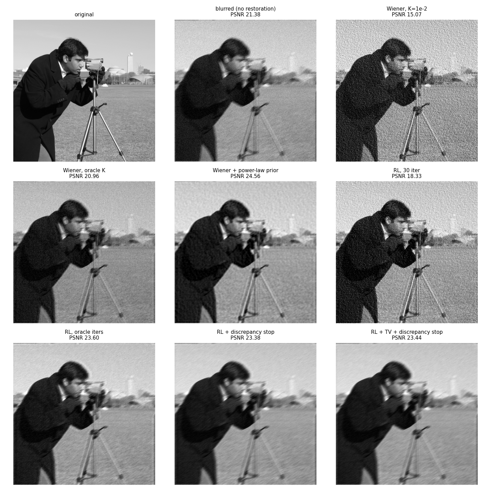

# Image deconvolution: Wiener & Richardson–Lucy with blind regularisation

Восстановление изображений по модели `y = h * x + n` (размытие + гауссов шум).
Все методы реализованы с нуля на NumPy/FFT; scikit-image используется только для тестовых изображений и метрик.

## Результаты

36 случаев: 4 изображения × 3 PSF (gaussian, motion, defocus) × 3 уровня шума σ ∈ {0.01, 0.05, 0.1}.

| метод | σ=0.01 PSNR / SSIM | σ=0.05 | σ=0.1 |
|---|---|---|---|
| размытое (без восстановления) | 25.90 / 0.69 | 22.39 / 0.32 | 18.80 / 0.16 |
| Wiener, K подобран по истинному изображению (oracle) | 27.56 / 0.66 | 23.04 / 0.45 | 20.82 / 0.33 |
| RL, число итераций подобрано по истинному изображению (oracle) | 28.89 / 0.75 | 26.45 / 0.64 | 25.17 / 0.57 |
| **Wiener + степенной спектральный prior (слепой)** | 29.33 / 0.76 | **26.93 / 0.68** | **25.89 / 0.65** |
| **RL + TV + останов по невязке (слепой)** | **29.33 / 0.81** | 26.40 / 0.69 | 25.15 / 0.60 |

* Лучшая из предложенных модификаций **без доступа к истинному изображению** превосходит классические методы с
  oracle-подбором гиперпараметров в 33 из 36 случаев (в среднем +0.65 dB PSNR).
* Относительно классических методов с параметрами по умолчанию: +5.2 dB в среднем, 36/36.

Полная таблица - `results/metrics.csv`, сводка - `results/summary.md`.



## Что сделано и почему это работает

**Wiener со степенным prior.** Константа `K` в классическом фильтре `conj(H) / (|H|² + K)` - это отношение шум/сигнал,
предположенное одинаковым на всех частотах. Но спектр естественных изображений спадает как `A/|f|^β` (β≈2),
поэтому на высоких частотах сигнал тонет в шуме гораздо сильнее, чем на низких. Фильтр
`W = conj(H)·S_x / (|H|²·S_x + Nσ²)` с `S_x = A|f|^-β` - это MMSE-оценка, а `A`, `β` и `σ` оцениваются
по самому наблюдению (радиальное усреднение спектра + оценщик шума Immerkær).

**RL + останов по принципу невязки Морозова.** RL это EM-алгоритм для пуассоновского правдоподобия;
он полуконвергентен: ошибка сначала падает, потом алгоритм начинает объяснять шум.
Останавливаемся на первой итерации, где `‖Hu − y‖² ≤ Nσ²` - модель описывает данные ровно до уровня шума.
Число итераций адаптируется само: ~30 при σ=0.01 и 2–4 при σ=0.1.

**RL + TV** добавляет полную вариацию в функционал: подавляет звон и шум, сохраняя края.

## Запуск

```bash
pip install -r requirements.txt
python src/run_benchmark.py                        # встроенные тестовые изображения
python src/run_benchmark.py --images data/original # свои изображения (например, SIPI)
pytest -q                                          # проверки: сопряжённость H/Hᵀ, сохранение потока в RL и др.
```

## Структура

```
src/deconv.py          методы восстановления и оценка шума
src/run_benchmark.py   эксперимент, метрики, графики
tests/                 проверки математических свойств
results/, figures/     результаты (воспроизводимы, seed=42)
```

## Ограничения

PSF считается известной (неслепая деконволюция); граничные условия периодические;
шум аддитивный гауссов. Следующий шаг - оценка PSF и сравнение с нейросетевыми методами.
